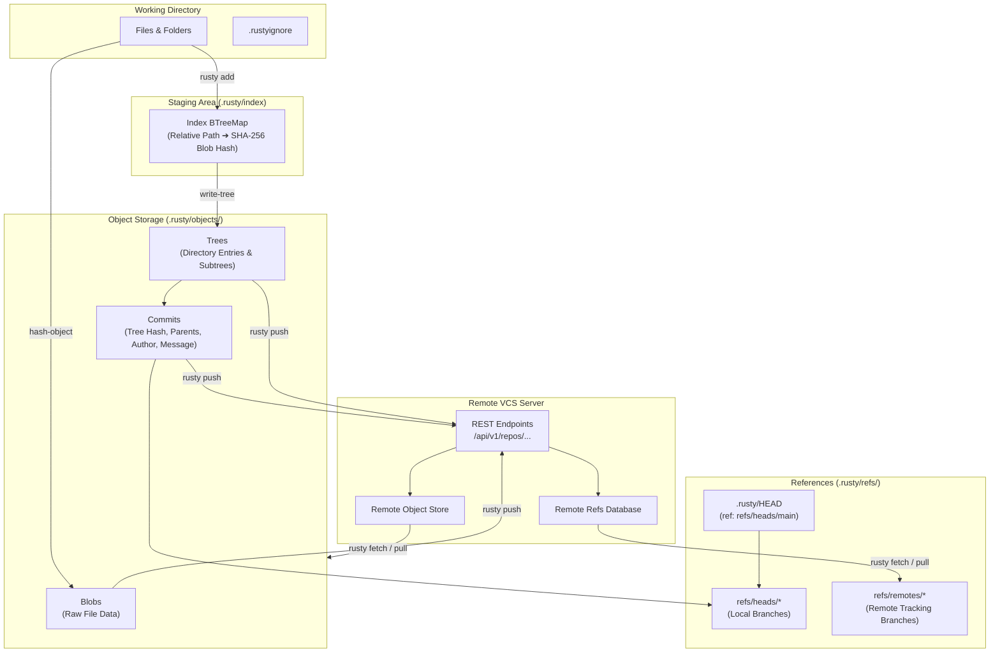

<div align="center">

# Rusty VCS

**A distributed Version Control System built in Rust, featuring a full CLI and an interactive Ratatui Terminal UI.**

[](https://www.rust-lang.org/)
[](./LICENSE)
[](https://github.com/ratatui-org/ratatui)
[](#installation)

[Overview](#overview) • [Key Features](#key-features) • [Architecture](#architecture) • [Installation](#installation) • [CLI Reference](#cli-reference) • [Interactive TUI](#interactive-terminal-ui-tui) • [Remote Sync Protocol](#remote-sync--backend-protocol) • [Testing](#testing--validation) • [License](#license)

---

</div>

<div align="center">
  
</div>

---

## Overview

**Rusty** is a lightweight, distributed Version Control System designed from scratch in pure Rust. It provides full control over content addressing, staging indexes, recursive tree graphs, branch lineages, ancestor-based 3-way conflict merging, and secure HTTP remote synchronization with remote Git/VCS backends.

Whether you prefer the precision of a UNIX CLI or the visual workflow of a keyboard-driven Terminal Dashboard, Rusty delivers both with zero external git dependencies.

---

## Key Features

### Content-Addressed Storage & Object Model
- **Cryptographic Object Integrity:** Uses SHA-256 for deterministic hashing across all Git-like objects (`blobs`, `trees`, and `commits`).
- **Hierarchical Tree Resolution:** Deterministically constructs directory trees and subtrees with nested hashing.
- **Index Staging Mechanism:** Binary index tracking staged files, modified entries, and deletions.
- **Ignore Rules Engine (`.rustyignore`):** Pattern matching supporting file names, glob wildcards, trailing-slash directory rules, and nested paths.

### Branching, Tree Traversal & Checkout
- **Reference Tracking:** Branches stored as lightweight references under `.rusty/refs/heads/`.
- **Atomic Checkout:** Safely unpacks commit tree hierarchies into working tree directories while pruning removed files.
- **Detached & Attached HEAD Management:** Seamless branch switching with symbolic reference resolution.

### 3-Way Merge & Conflict Resolution Engine
- **Graph Ancestry Resolution:** Automatically searches parent lineages to find the Lowest Common Ancestor (LCA).
- **Fast-Forward & 3-Way Merge:** Auto-detects fast-forward situations and executes 3-way recursive content merges.
- **4-Way Conflict Classification:** Handles complex conflict classes:
  - `BothModified`: Concurrent changes to identical files.
  - `ModifyDelete`: File modified on one branch and deleted on the other.
  - `DeleteModify`: File deleted locally and modified remotely.
  - `AddAdd`: Distinct files created under the same path.
- **Merge State Tracking:** Records merge in-flight metadata in `MERGE_HEAD` and `MERGE_STATE`, with clean `rusty merge --abort` rollback.

### Remote Synchronization & Authentication
- **REST Protocol Client:** Connects to any compatible Git Version Control server.
- **Object Deduplication:** Proactively checks `object_exists` before pushing blobs/trees to minimize network transfer.
- **Remote Tracking Branches:** Stores server state locally in `.rusty/refs/remotes/<remote>/<branch>`.
- **Fetch & Pull Engine:** Downloads remote commit DAGs and fast-forwards/merges local tracking branches.
- **PAT & Bearer Authentication:** Secure credential caching in `~/.rusty/credentials.json`.

### Interactive Terminal UI (TUI)
- **Built with Ratatui & Crossterm:** Responsive dashboard with custom themes.
- **Keyboard & Mouse Driven:** Full support for hotkeys (e.g., `s` for Status, `c` for Commit, `b` for Branch, `m` for Merge, `p` for Push) and mouse click hitboxes.
- **Non-blocking Process Execution:** Built-in stdout/stderr capture prevents alternate screen corruption.
- **Interactive Modals:** In-terminal forms for authentication, branch creation, commit messages, and remote configuration.

---

## Architecture & Internal Workflow



### `.rusty` Repository Directory Structure

```text
.rusty/
├── config                     # JSON remote configurations and repository settings
├── HEAD                       # Current ref pointer (e.g., ref: refs/heads/main)
├── index                      # JSON serialized staging index
├── MERGE_HEAD                 # Commit hash of in-progress merge (if active)
├── MERGE_STATE                # Unresolved conflict tracking (if active)
├── objects/
│   ├── blobs/                 # SHA-256 addressed file payloads
│   ├── trees/                 # Serialized directory trees
│   └── commits/               # Serialized commit manifests
└── refs/
    ├── heads/                 # Local branches (e.g., main, dev, feature)
    └── remotes/
        └── origin/            # Remote tracking branches (e.g., origin/main)
```

---

## Installation

### Prerequisites
- **Rust Toolchain:** Rust 1.85+ (Edition 2024 recommended)
- **Cargo:** Package manager (included with Rust)

### Build from Source

```bash
# Clone repository
git clone https://github.com/your-username/rusty.git
cd rusty

# Build release binary
cargo build --release

# The compiled binary is available at target/release/rusty
# Optionally, install it to your cargo bin directory:
cargo install --path .
```

---

## CLI Reference

### 1. Repository Setup & Status

```bash
# Initialize a new Rusty repository in the current directory
rusty init

# Check working tree status (untracked, modified, staged files)
rusty status

# Calculate SHA-256 hash of a file and store it as a blob
rusty hash-object <file-path>

# Write current staging index to a tree object
rusty write-tree
```

### 2. Staging & Commits

```bash
# Stage a file or directory
rusty add <file-path>
rusty add .

# Unstage a file from the index without deleting it from disk
rusty rm --cached <file-path>

# Commit staged changes
rusty commit -m "feat: implement distributed authentication"

# View commit history
rusty log
```

### 3. Branching, Switching & Merging

```bash
# Create a new branch
rusty branch <branch-name>

# List local branches (* indicates current HEAD)
rusty branch

# List remote-tracking branches
rusty branch -r

# List all local and remote branches
rusty branch -a

# Switch to a different branch
rusty checkout <branch-name>

# Merge a branch into the current branch (Fast-Forward or 3-Way Merge)
rusty merge <branch-name>

# Abort an in-progress merge and restore HEAD state
rusty merge --abort
```

### 4. Authentication & Remote Management

```bash
# Authenticate CLI with your VCS server account
rusty login --server http://localhost:3000

# View current logged-in identity
rusty whoami

# Clear stored credentials
rusty logout

# Add a remote repository
rusty remote add origin http://localhost:3000/repos/<owner>/<repo-name>

# Fetch remote objects and tracking references
rusty fetch

# Pull changes from remote tracking branch into current branch
rusty pull

# Push commits, trees, and blobs to remote
rusty push
```

---

## Interactive Terminal UI (TUI)

Launch the interactive dashboard at any time:

```bash
rusty tui
# or simply
rusty
```

### TUI Navigation & Shortcuts

| Shortcut Key | Action | Description |
| :---: | :--- | :--- |
| `1` / `Esc` | **Dashboard** | Return to primary overview dashboard |
| `2` / `s` | **Status** | Inspect working tree changes and staged files |
| `3` / `a` | **Add / Stage** | Open modal to stage files or all (`.`) into index |
| `4` / `c` | **Commit** | Open commit prompt with message editor |
| `5` / `l` | **Log** | View commit graph and history |
| `6` / `b` | **Branches** | Browse branch list / create new branches |
| `7` / `o` | **Checkout** | Switch active working tree branch |
| `8` / `m` | **Merge** | Trigger 3-way merge or view active merge status |
| `x` | **Abort Merge / Clear** | Abort active merge (in merge view) or clear terminal log |
| `f` | **Fetch** | Fetch objects from configured `origin` remote |
| `u` | **Pull** | Pull and synchronize remote branch into current |
| `p` | **Push** | Push missing DAG objects and update remote ref |
| `r` | **Remote** | Configure or update remote URLs |
| `Tab` | **Login Dialog** | Open authentication modal (Email, PAT, Server URL) |
| `w` | **Whoami** | Inspect current user session and authentication |
| `O` | **Logout** | Disconnect credentials session |
| `R` | **Rm (Cached)** | Unstage files from the index |
| `?` / `h` | **Help** | Open shortcut and documentation modal |
| `q` / `Ctrl+C` | **Quit** | Exit TUI and restore terminal state |

---

## Remote Sync & Backend Protocol

Rusty communicates with server backends via standard JSON REST endpoints:

```text
POST   /api/v1/auth/cli/login            -> Verify Personal Access Token (PAT)
GET    /api/v1/repos/:owner/:repo/refs   -> List all remote branch references
POST   /api/v1/repos/:owner/:repo/refs   -> Update branch reference commit SHA
GET    /api/v1/repos/:owner/:repo/objects/:hash/exists -> Deduplication check
POST   /api/v1/repos/:owner/:repo/objects -> Upload blob, tree, or commit object
GET    /api/v1/repos/:owner/:repo/objects/:hash -> Download object payload
```

### Authentication Headers
All remote operations include standard bearer authentication:
```http
Authorization: Bearer <PAT_TOKEN>
X-Rusty-Email: <user@domain.com>
X-Rusty-Token: <PAT_TOKEN>
```

---

## Testing & Validation

Rusty contains an automated test suite covering unit operations, edge cases, conflict classifications, and directory ignore logic.

```bash
# Run all unit and integration tests
cargo test

# Run tests with verbose output
cargo test -- --nocapture
```

### Verified Test Matrix
- **Ignore Engine:** Root, nested, wildcard, and directory-specific `.rustyignore` rules.
- **Binary Detection:** Safe handling of binary blobs during 3-way merge operations.
- **3-Way Conflict Engine:** Accurate resolution and classification of `BothModified`, `ModifyDelete`, `DeleteModify`, and `AddAdd`.
- **Ancestor Discovery:** Lowest Common Ancestor (LCA) traversal across complex DAG histories.
- **Merge State Serialization:** Validated `MERGE_STATE` round-trip storage and abort recovery.
- **CLI & TUI Sandboxing:** Verified against headless pseudo-terminals (`pty`) with zero ANSI leakage.

---

## Contributing

Contributions, issues, and feature requests are welcome:

1. Fork the project
2. Create your feature branch (`git checkout -b feature/AmazingFeature`)
3. Commit your changes (`git commit -m 'feat: add some AmazingFeature'`)
4. Push to the branch (`git push origin feature/AmazingFeature`)
5. Open a Pull Request

---

## License

Distributed under the MIT License. See [`LICENSE`](./LICENSE) for full details.
